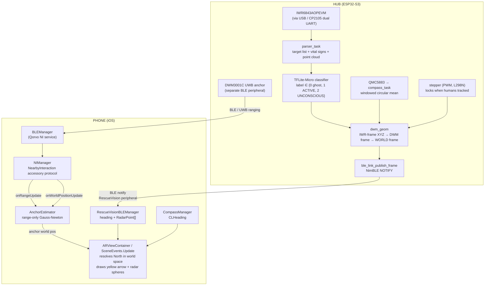

# RescueVision

**See people through walls, smoke, and fire — with a phone and a hub.**

RescueVision is a two-part system that lets a first responder walk into an unfamiliar building during an emergency and watch a live AR map of human-shaped targets — including unresponsive ones — superimposed onto whatever the phone's camera can see. The targets are detected by an mmWave radar that doesn't care about drywall, smoke, soot, or darkness, and they're rendered through the phone's UWB and compass so the responder can simply point the phone and see the room "X-rayed" with people pinned where they actually are.

---

## Why this project exists

Optical / IR / lidar / acoustic search tools all fail in the same scenarios firefighters and rescue teams care about most:

- **Drywall, plaster, lath, sheet metal** stop visible light, IR cameras, and lidar.
- **Smoke and steam** blind both optical and thermal sensors.
- **Active fire** swamps the IR band — a thermal camera looking at flames is useless for spotting a body.
- **Unresponsive victims** can't shout, knock, or trigger motion sensors.

What goes *through* all of those is **60 GHz mmWave radar**: it cuts through drywall and smoke largely unaffected, and TI's IWR6843 family can pull a **heart-rate and breathing-rate vital-signs estimate** out of micro-motion at the chest, which is exactly the signal you need to tell an unconscious person apart from a couch.

The problem with a radar by itself is that a 2-D dot on a laptop is useless to someone wearing an air pack and crawling. RescueVision solves that by:

1. Pre-installing a **fixed radar/UWB hub** in the room or hallway being monitored.
2. Letting any responder walk in carrying nothing more than **a normal smartphone** — one that has an IMU, a magnetometer (compass), a screen, BLE, and a UWB chip (every modern flagship since the iPhone 11 / Pixel 6 Pro / Galaxy S21+ has all five).
3. Using UWB ranging + AR + compass alignment to project the radar's world-frame target list onto the **camera feed in front of the responder**, so it visually feels like the walls have gone transparent.

The only person who needs to do any setup is whoever installs the hub. Responders just open the app.

---

## Equipment

### Hub side (installed once, per room/hallway)

A small board mounted somewhere with a view of the area to monitor:

| Component | Role |
|---|---|
| **ESP32-S3** | Brains. USB host for the radar, BLE peripheral for the phone, I²C master for the compass, and PWM driver for the stepper. |
| **TI IWR6843AOPEVM** | 60 GHz mmWave radar running TI's *Vital Signs with People Tracking* SDK. Provides 3-D target tracks + per-target heart/breath rate. |
| **Qorvo DWM3001C** (on the Arduino sender, see `arduino/uno_sender`) | UWB anchor. This is the device the phone ranges to. |
| **QMC5883L / QMC5883P magnetometer** | World-frame compass for anchoring radar bearings to North. |
| **NEMA-17-class stepper + L298N** | Periodically sweeps the radar/UWB head ±90° so a single hub covers more area. Locks the moment a person is detected, so a victim is never tracked through motion artifacts. |

### Responder side

Anything that's effectively a modern smartphone:

- IMU + magnetometer (for AR pose and CoreLocation compass heading)
- Screen + camera (for the AR view)
- BLE central (one connection to the radar hub, one to the UWB anchor)
- UWB radio (Apple U1/U2 via NearbyInteraction, or the equivalent on Android)

No headset, no thermal optic, no special harness. The current implementation targets iOS (`ios` branch of this repo) and uses Apple's NearbyInteraction framework, ARKit, RealityKit, and CoreLocation. Everything else (Bluetooth, radar parsing, world-frame math) is shared by anything that speaks BLE.

---

## One-time hub calibration

The whole architecture rests on the radar publishing **world-frame bearings** (compass bearings clockwise from True/Magnetic North) rather than sensor-frame bearings. To do that the hub needs two things resolved at install time:

### 1. Magnetometer hard-iron offset

The QMC5883 sits inches away from a stepper motor and an L298N driver — both of which produce a huge static magnetic offset that would otherwise pin the heading to whatever direction the magnet is in. [src/compass.c](src/compass.c) handles this by:

- Continuously running min/max on raw X/Y. Their midpoint is the hard-iron offset; the calibrated reading is `(raw − offset)`.
- Requiring the installer to **rotate the entire assembly through a full 360° sweep**. The chip's heading samples are bucketed into eight 45° sectors, and each sector is only "confirmed" after five consecutive in-sector readings ≤ 2° apart from each other (≈ 25 ms minimum stable dwell at 200 Hz). All 8 sectors must confirm. This dual gate (sector coverage **and** per-sample stability) rejects both single-sample noise and "swept too fast" transients — a stationary noisy device can only ever confirm one sector.

While this is happening, the firmware prints `[ROTATE]` next to every heading sample and asks the installer to rotate the rig. Once all 8 sectors confirm it latches to `[CAL]` and never re-checks — the offset is now a permanent property of the assembly.

### 2. World-frame geometry

The IWR's mmWave array and the DWM's UWB antenna live on the same rotating top plate, but they are not co-located. [include/dwm_geom.h](include/dwm_geom.h) hardcodes the SolidWorks-measured rigid offset between the two (`DWM_GEOM_OFFSET_*_MM`, plus a 10° tilt around the IWR's X axis) so the firmware can translate any IWR-frame detection into the DWM's frame, and from there — using the calibrated compass — into a world frame anchored to magnetic North. See [src/dwm_geom.c](src/dwm_geom.c) for the full transform (`dwm_transform_iwr_xyz`).

The world frame's current heading is the **circular mean of the last 10 compass samples** combined with the stepper's accumulated angle:

> `assembly_world_heading = circular_mean(last_10_compass_samples) − stepper_angle`

This is recomputed live on every published frame; nothing about the world frame is "frozen" at calibration time except the magnetic offset. That keeps the system robust to slow drift if the hub is ever physically rotated post-install.

### 3. Calibration gates in series

The whole hub is gated so that nothing publishes garbage upstream:

1. **Compass calibration** — installer rotates 360°, all 8 sectors confirm. ([src/compass.c:271-298](src/compass.c#L271-L298))
2. **DWM geometry ready** — calibration gate latches open. ([src/dwm_geom.c:82-88](src/dwm_geom.c#L82-L88))
3. **IWR config + first frame received** — stepper locks here and from then on only moves when no humans are being tracked. ([src/stepper.c:106-117](src/stepper.c#L106-L117))
4. **BLE publish suppressed** until both `ble_link_is_subscribed()` and `dwm_geom_is_calibrated()`. ([src/iwr6843.cpp:514-520](src/iwr6843.cpp#L514-L520))

After install, the box just runs.

### 4. Per-responder compass alignment (every connection)

Even with the hub perfectly calibrated, the phone's magnetometer and the hub's magnetometer can disagree by a fixed offset — different magnetic environments, different chips. The iOS app exposes an **"Align Compass"** button that captures `compassOffset = phoneHeading − espHeading` at one moment and adds it to every subsequent bearing from the hub. ([ios](../ios) branch: `RescueVisionBLEManager.compassOffset` is read per-frame inside `ARViewContainer.swift`'s `SceneEvents.Update`.)

This is a one-button operation that takes about a second; it's not part of the install procedure, it's part of putting the phone on for the shift.

---

## How it's implemented

### Top-level data flow



### Hub firmware (this directory)

[src/main.c](src/main.c) is intentionally tiny — it just brings up each subsystem in the right order:


#### Radar pipeline ([src/iwr6843.cpp](src/iwr6843.cpp))

- The IWR6843AOPEVM speaks over USB via a CP2105 dual-UART bridge (CLI @ 115200 baud, DATA @ 921600 baud). [IWR6843_ARCHITECTURE.md](IWR6843_ARCHITECTURE.md) documents the hardware quirks (VBUS splice, magic-word sync, TLV alignment) in detail.
- `send_config_task` blasts [include/vital_signs_cfg.h](include/vital_signs_cfg.h) into the CLI port one line at a time, blocking on `Done` / `Error` ACKs.
- `parser_task` drains the high-rate DATA-port stream buffer, locks onto the `02 01 04 03 06 05 08 07` magic word, and decodes the per-frame TLVs: 3-D target list (1010), per-target vital signs (1040), compressed point cloud (1020).
- Each track is classified as **0 ghost / 1 ACTIVE / 2 UNCONSCIOUS** by a TFLite-Micro neural net (`rescue_vision_model.tflite`, embedded as a C array in [include/rescue_vision_model.h](include/rescue_vision_model.h)) running on-device through `MicroInterpreter` with a 15 KB tensor arena. The features are `(x, y, z, vx, vy, vz, confidence, HR, BR, BR_dev)`, z-scored against `feature_means`/`feature_scales` baked into the model header. Compile-time `HEURISTIC_GATES` switches the classifier between off / C-logic / NN.
- Extra constant-velocity sanity gates reject anything moving > 4 m/s or teleporting > 1 m between frames — radar artifacts, not people.
- For every accepted track, `dwm_transform_iwr_xyz` lifts the (x,y,z) into the world frame, and the result is packed into a `ble_link_point_t` ([include/ble_link.h](include/ble_link.h)) — a packed 8-byte record carrying `distance_mm`, `bearing_cdeg` (world bearing × 100, CW from N), `elevation_cdeg`, and `class_id`.

#### Geometry ([src/dwm_geom.c](src/dwm_geom.c))

Three rigid transforms, all in one function:

1. `Rx(+TILT)` — rotate the IWR's body axes to match the DWM's body axes (the IWR is tilted 10° around its X axis).
2. Translate by the IWR→DWM offset measured in SolidWorks.
3. Rotate around Z by `windowed_compass_heading − stepper_angle` to take the DWM body vector into world-North-up coordinates.

Outputs are `distance_mm` (frame-invariant straight-line from DWM), `world_bearing_deg` ∈ [0, 360) clockwise from North, and `world_elevation_deg` ∈ [−90, +90].

#### BLE link ([src/ble_link.c](src/ble_link.c) / [include/ble_link.h](include/ble_link.h))

NimBLE peripheral, single notify characteristic, single subscriber. Wire format:

```
Header (12 bytes, little-endian)
  uint32 frame_num
  uint32 timestamp_ms
  uint16 dwm_heading_cdeg     // assembly heading × 100, CW from N
  uint16 point_count          // points in THIS notification

Point (8 bytes each, packed)
  uint16 distance_mm
  uint16 bearing_cdeg          // world bearing × 100, CW from N
  int16  elevation_cdeg        // world elevation × 100
  uint16 class_id              // 1 = ACTIVE, 2 = UNCONSCIOUS
```

If a frame doesn't fit in the MTU it gets split across several notifications that share the same `frame_num`; the receiver stitches by `frame_num` and discards partial accumulation when it changes. Publish is suppressed until *both* a peer is subscribed *and* the world-frame is calibrated.

#### Stepper ([src/stepper.c](src/stepper.c))

L298N + bipolar coil sequence on GPIO 47/48/45/38, with PWM (LEDC, 20 kHz, ~68% duty) on ENA/ENB to keep the driver cool. The task:

1. Waits for IWR config+frame, then **locks** the motor by holding a single step pattern.
2. Waits for the compass calibration gate.
3. Enters a `CW, CW, CW, CW, CCW, CCW, CCW, CCW` infinite loop — 8 × 90° dwells covering a full back-and-forth — with `iwr6843_pause_listening()` toggling the parser off during motion and a 10 s dwell after each step.
4. **Pauses indefinitely** the moment a human is actively tracked, so a victim is never lost to motion artifacts mid-sweep.

### Phone app (`ios` branch)

The phone runs six managers wired together in [`NearbyDemoApp.swift`](../ios) ([ios branch](../ios)):

| Manager | Role |
|---|---|
| `BLEManager` | Connects to the **Qorvo DWM3001C UWB anchor**. Bridges raw bytes between BLE and the NearbyInteraction state machine. Auto-reconnects on disconnect and fires `onDisconnected` so dependent state (NI session, anchor estimate) tears down cleanly. |
| `NIManager` | Drives the Apple NearbyInteraction accessory protocol (`0x0A` init → `0x01` board config → `0x0B` configure-and-start). Receives raw UWB ranges and, when camera-assisted UWB+ARKit fusion converges, a full world-space position. |
| `ARManager` | Owns the `ARSession`. Maintains an interpolated pose history (`PoseInterpolator`) so range measurements can be paired with the exact AR pose at the measurement timestamp. |
| `AnchorEstimator` | Range-only Gauss-Newton multilateration. Holds a 50-measurement window, requires ≥ 8 cm RMS phone-motion spread before solving (otherwise the problem is geometrically singular), bootstraps for the first 15 measurements with outlier rejection off, then locks in a 0.5 m outlier gate. Used when camera-assisted fusion isn't available; superseded by it when it is. |
| `RescueVisionBLEManager` | Connects to the **RescueVision radar hub** (separate BLE peripheral, separate `CBCentralManager`, zero coupling to the UWB BLE stack). Parses the 12-byte header + 8-byte point records, stitches multi-notification frames by `frame_num`, and publishes `heading` and `latestPoints: [RadarPoint]`. Also holds the per-responder `compassOffset` set by the "Align Compass" button. |
| `CompassManager` | Wraps `CLLocationManager` heading updates; exposes magnetic heading + calibration quality and auto-shows the system calibration UI if uncalibrated. |

#### Rendering the radar through the camera ([ios branch: ARViewContainer.swift])

Every rendered frame, inside a `SceneEvents.Update` subscription:

1. **Anchor sphere** — exponentially smoothed (`α = 0.12`, ≈ 120 ms time constant) version of `AnchorEstimator.anchorPosition`. Red sphere parented to a world-zero `AnchorEntity`.
2. **Off-screen indicator** — if the projected anchor is outside the view bounds, compute an on-screen angle (orientation-aware) and show a red `location.north.fill` arrow at the edge of the screen pointing at it.
3. **Resolve North in ARKit world space** — ARKit's camera +X is always sensor-right (landscape-right native frame). Portrait-top = camera −X projected to the horizontal plane. `CLHeading.magneticHeading` is degrees CW from North that the portrait-top points → rotate the portrait-top vector CCW by that heading to land on North in world coordinates. This vector is the *shared* primitive for both the heading arrow and the radar points; if the compass isn't usable, both features hide together.
4. **Heading arrow** — yellow cylinder + cone parented to the anchor, oriented along North rotated CW by `(espHeading + compassOffset)`. Shows live which way the hub thinks it's pointing.
5. **Radar point cloud** — three pre-allocated pools of 10 sphere entities each (green / orange / gray for ACTIVE / UNCONSCIOUS / ghost) parented to the same world anchor. For each `RadarPoint`:

   ```
   horizDir = rotate(northInWorld, CW by bearingDeg + compassOffset)
   worldPos = anchorPos
            + horizDir × (distance × cos(elevation))    // horizontal offset
            + (0, distance × sin(elevation), 0)          // vertical offset (ARKit Y = up)
   ```

   Pool entities are enabled in-place rather than added/removed each frame, so there's no entity-lifecycle churn.

The result, in the responder's hand: a live camera feed of the room with green spheres on people who are moving and orange spheres on people who aren't — even when the people are behind walls or hidden by smoke — plus a yellow arrow showing which way the radar hub is currently facing.

---

## Future work: a multi-band hub

60 GHz mmWave is the right starting band — it's the only one with a turnkey, low-power module that already does target tracking *and* vital-signs extraction. But it's also where most of the current system's limitations come from:

- **One wall, maybe two.** At 60 GHz, drywall attenuation is on the order of 5–10 dB per layer, plus another 10–15 dB per stud-bay reinforcement. By the third interior wall there isn't enough return left to track.
- **Nothing through concrete or rebar.** A pour wall, a poured slab, or rubble (the exact scenarios where collapsed-structure SAR happens) reflects 60 GHz almost completely.
- **Beam-width vs. resolution tradeoff is fixed by the antenna.** The IWR6843AOPEVM has the beam shape it has; we sweep it on a stepper to compensate, but each sweep takes seconds.

Each of these is fixable by adding *another* radar in *another* band on the same rotating head, broadcasting into the same world frame through the existing `ble_link.h` wire format. Because every published point is already a world-bearing + distance + classification, the phone doesn't need to know or care which sensor produced any given point. Adding a band is purely additive — no protocol changes, no new manager on the iOS side, no new calibration step for the responder.

### Candidate complementary bands

| Band | Example part | What it adds |
|---|---|---|
| **3–10 GHz UWB impulse radar** | Novelda X4 / Salsa, Cerebro | Designed exactly for through-wall presence and respiration. ~10 m range through 2–3 interior walls. Lower angular resolution than 60 GHz, but its strength is binary "is there a heartbeat behind this surface?" — a perfect cross-check on uncertain UNCONSCIOUS calls from the 60 GHz classifier. |
| **24 GHz FMCW** | Infineon BGT24LTR11, Acconeer A111 | Wider beam, more forgiving propagation through wood/plaster, much cheaper. Good as a coarse "is anyone in this 90° wedge?" pre-filter before the stepper hands fine-pointing duty to the IWR6843. Cuts sweep time dramatically when the room is empty. |
| **L-band / UHF (~1–2 GHz)** | Custom FMCW, or COTS modules like NIITEK / RANGE-R derivatives | The only band that reliably gets *into* reinforced concrete and rubble piles. Range resolution is meters, not centimeters — useless for vitals, but enough to say "there is a body roughly here, 4 m deep into this pile." This is the band that turns RescueVision from a building-search tool into a collapse-search tool. |
| **Passive thermal (LWIR microbolometer)** | FLIR Lepton 3.5 | Not strictly a "band" in the radar sense, but it's the obvious sensor-fusion partner for the smoke-but-no-flames case. Cheap, small, and gives the classifier a per-track "warm body" feature that the radar can't directly observe. |

### What multi-band changes about the system

The hub already publishes world-frame points; adding sensors is mostly a matter of giving each one its own task and feeding its detections through the same `dwm_transform_iwr_xyz`-style transform into the same `ble_link_publish_frame` call. The interesting new logic is:

1. **Cross-band fusion at the track level.** The same physical person should produce a track in 60 GHz *and* a presence blob in 3–10 GHz UWB *and* a warm spot on the thermal. A simple gating association (Mahalanobis-distance match in world coordinates) lets the classifier upgrade confidence dramatically — three independent physics measuring the same target is the strongest signal you can give a TFLite model trained on radar alone.
2. **Band-aware `class_id`.** The wire format already carries a `class_id`; extending it (`UWB_PRESENCE`, `CONCRETE_PENETRATING_HIT`, etc.) lets the phone render different glyphs without protocol churn. Existing iOS pools (`activePool`, `unconsciousPool`, `ghostPool`) generalize to N pools trivially.
3. **Adaptive sweep policy.** Today the stepper sweeps a fixed pattern and pauses on humans. With a 24 GHz wide-beam pre-screen, it could skip empty sectors entirely and dwell longer on sectors where *any* band has a candidate — dropping average time-to-detect for a victim from tens of seconds to a few.
4. **Power & antenna sharing.** All bands of interest fit on the same rotating head; the only new mechanical work is antenna placement. The 60 GHz patch and L-band horn won't interfere because they're octaves apart, but the IWR6843's USB-host budget on the ESP32-S3 is already most of the bus, so a second high-rate radar likely wants its own MCU bridged over UART or SPI.

### What stays the same

The responder's side does not change. Same phone, same app, same one-button compass alignment, same AR scene. The hub just gets smarter and starts populating it with more — and more confident — points.

---

## Build / run

This directory is an ESP-IDF project (also configured as a PlatformIO project — see [platformio.ini](platformio.ini)). Standard `idf.py build flash monitor` works against the `esp32-s3-devkitc-1` target. The iOS app lives on the `ios` branch and builds with Xcode against any device that supports NearbyInteraction (iPhone 11 and newer with a U1/U2 chip).

See [IWR6843_ARCHITECTURE.md](IWR6843_ARCHITECTURE.md) for the hardware-side details on USB host enumeration, the CP2105 VBUS splice, TLV parsing safety, and the historical bugs.
